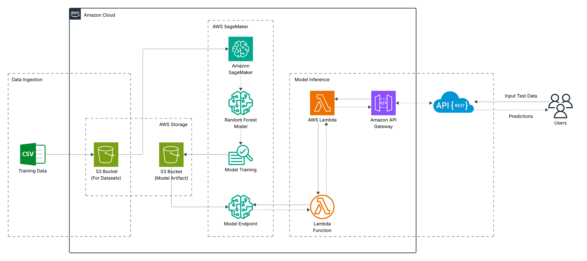

# End-to-End MLOps Workflow with AWS S3, SageMaker, Lambda, & API Gateway

## 🚀 Project Overview
This project demonstrates a complete machine learning pipeline using **AWS SageMaker**, showcasing how to prepare data, train a model, deploy it as an endpoint, perform inference utilizing **AWS Lambda** and **AWS API Gateway**, and then clean up resources — all programmatically from your local IDE.

This demo covers:

- Uploading data to the Amazon S3 bucket
- Writing a training script (`script.py`)
- Launching an AWS SageMaker training job
- Deploying the trained model as a real-time endpoint
- Accessing the endpoint using AWS Lambda
- Accessing the Lambda component using the AWS API Gateway with REST API
- Making predictions on test data through Lambda & API Gateway 
- Tearing down the model endpoint to avoid extra costs

## 📊 Architecture Diagram

---

## 🧠 Key Learnings

**1. End-to-End Machine Learning Lifecycle on AWS**
- Understood and implemented the full ML pipeline:
  - Data preprocessing
  - Model training
  - Model evaluation
  - Deployment to a real-time endpoint

*"Learned to take a raw dataset from CSV all the way to a production-ready inference pipeline using AWS."*

**2. SageMaker Hands-on**
- Used SageMaker’s built-in XGBoost estimator
- Uploaded datasets and models to Amazon S3
- Trained and deployed a model using SageMaker Estimator API
- Created and invoked a SageMaker real-time endpoint

*"Explored model versioning, cloud storage for data/model artifacts, and deployment best practices."*

**3. API Gateway + Lambda Integration**
- Created an API Gateway endpoint to expose ML model as a REST API
- Wrote and deployed a Lambda function to:
  - Handle requests
  - Format input payloads
  - Invoke SageMaker endpoint
  - Return prediction response

*"Gained hands-on experience with event-driven serverless architecture and AWS IAM permission management."*

**4. Security and IAM Role Management**
- Assigned and tested IAM roles/policies for:
  - Lambda to invoke SageMaker
  - SageMaker to access S3 buckets

*"Learned how AWS resource permissions can be scoped securely using roles and policies."*

**5. Architecture Design & Documentation**
- Created a complete architecture diagram
- Understood how to document and communicate a cloud ML system effectively

*"Now confident in presenting ML systems to technical and non-technical stakeholders."*

**6. Soft Skill**

*“This project also helped me improve my problem-solving mindset. I faced real deployment issues — like payload serialization, permission errors, 500s — and resolved them independently using AWS docs, StackOverflow, and logs.”*

## 💡 Future Scope & Enhancements
- Automate the Training Pipeline. Preferably trigger or schedule the pipeline using Airflow (or other tools)
- Build a simple Streamlit interface to submit predictions
- Connect SageMaker output to QuickSight or Grafana dashboards

